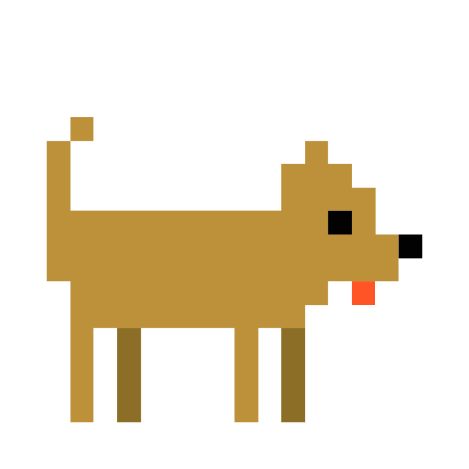

# koda



## Description

[Koda](https://koda.arualvivan.com/) is a curated collection of links I’ve gathered over time, some related to the tech world, but also unrelated things I find cool.


## Features

In Koda you can switch themes (light, dark, system), can search with plain text to find related results and listen to music (a youtube frame with my favorite playlist of all time)

## Project Setup

```sh
npm install
```

### Compile and Hot-Reload for Development

```sh
npm run dev
```

### Compile and Minify for Production

```sh
npm run build
```

---

Made with 💜 by Laura
